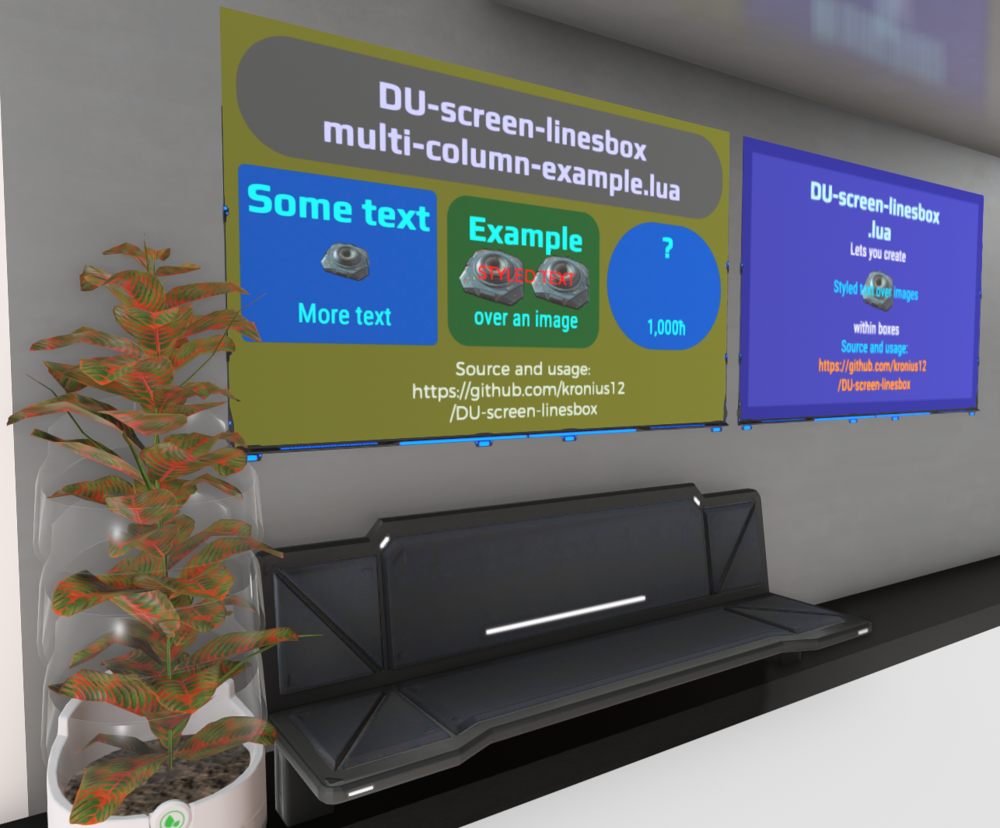

# DU-screen-linesbox
Source and usage: https://github.com/kronius12/DU-screen-linesbox
License: GNU Public License 3.0
Version: 1.1.0

Writes lines of text and images on top of a filled box in a screen using Lua in Dual Universe (game).  The idea was, once you have the styles and box sorted out, you only need to worry about the text. See github for examples.

At its simplest, the user need only provide text strings in a table.

At its core, it uses the method:

```lua
writeTextArea(layer, image layer, content [, other parameters see below])
```

This creates a column of text and images on a screen inside a box. Each line has text of a single style, an image, or both. Successive calls to writeTextArea() will create text
boxes at specified positions and sizes.

You're welcome to use freely. Donations in quanta (in-game currency) to Kronius.



# Usage

_In the file_ [`lua/DU-screen-linesbox.lua`](lua/DU-screen-linesbox.lua) _the user-editable code is in 3 sections. That is followed by methods that lay out the specified content._

## Basic Example

_In this example replace section 1 only, with the following:_

```lua
content= {
{message="A Heading", style="heading" },
{message="Some text."},
}
```
_You need do nothing else if you're happy with the styles provided, and no box._

## User-editable Code Sections

**1) Edit the content table,** which is a table where each line of text and/or an image is itself represented by a table.

Provide the following as a table `t`:
*  `t.boxBackgroundColor` (optional) = background colour of the box
*  `t.boxRadiusLines` (optional) = corner radius in multiples of default font size
*  `t.boxRadius` (optional) = corner radius in pixels, overriding `.boxRadiusLines`
*  `t = {contentLine, contentLine, ...}` = content to display, each a table representing a line of text, an image, both, or white space

Where `contentLine` is itself a table `c` with these elements, all optional:

*  `c.message` = one line of text of one style
*  `c.imgPath` = relative path URL to a NQ approved image or local resource
*  `c.align` = text alignment, either "left", "right or "center" (default)
*  `c.colorRgba` = text colour RGB in [0..255] eg. {255,255,255,1.0} is white
*  `c.style` = name of style
*  `c.lineHeight` = relative vertical distance from line above, or image height in lines; a "line" is defined by lineHeightDefault so can be in pixels, as pitch is adjusted accordingly; text is middle aligned vertically within the line, and lines a vertically justified.
*  `c.imgPosX`, `c.imgPosY` (both or none) = absolute top left pos of image relative to text box;
     image is centred and starts just below the line above if no pos given.
*  `c.imgWidth`, `c.imgHeight` (both or none) = size (for aspect ratio if no pos); aspect ratio defaults to 1.0 if either height or width are missing;

  Images scale to fit .lineHeight if no pos given, keeping aspect ratio, and any text will write on top, middle aligned on the image. NQ recommends not relying on this order, so image layer and optional box layer are input parameters.
  
  It is possible to specify a negative .lineHeight with no message or image, followed by one with a tall image, to create interesting effects such as an image behind multiple lines of text.

**2) Optionally edit the styles.** The following elements are optional, but
one fully-specified `default` style must be given. Where an attribute is not defined, the default value is used.

* `.fontName`, `.fontSize` = parameters used in loadFont(name, size)
* `.font` (use loadFont(), reuse loaded fonts where possible)
* `.colorRgba` = text color
* `.align` = text alignment, either 'left', 'right' or 'center' (default)

Example styles are given that might be used for simple signs.

N.B. do not exceed the screen API limit of 8 font name/size combos.

**3) Optionally edit the call to `writeTextArea()`,** to specify the text area background box dimensions/location and content. This function has the following parameters:

* `layer` = text layer id (mandatory)
* `imgLayer` = image layer id (mandatory, should differ from layer)
* `content` = table specifying lines of text or images (mandatory, see (1) above)
* `styles` = table of styles (mandatory, see 2 above)
* `xPos`, `yPos` = top left corner position on screen
* `width`, `height` = box width & height
* `paddingX`, `paddingY` = padding inside the box; user must size text to fit width
* `boxLayer`, `boxBackgroundRgba` = box layer and colour
* `boxRadius` = corner radius in pixels

## A longer Example

```lua
-- what to write
content={
    {"A Heading", style="heading"},
    {"Some text"}
}


-- some defaults
fontSizeDefault = 60         -- reduce this to fit more text
defaultLineHeight = 1.0      -- a standard line is 1 line high, or use fontSizeDefault if you'd rather work in pixels
defaultTextAlign = "center"  -- text and images
defaultPadding = 20          -- a little bit away from the edge
backgroundColor = {16,16,60} -- screen background

-- some styles
    local styles={}

    -- default must be fully specified
    styles.default={ 
        fontName="RobotoCondensed", 
        fontSize=fontSizeDefault, 
        lineHeight=defaultLineHeight,
        align=defaultTextAlign,
        colorRgba={255,255,255,1.0},
        }
    styles.default.font = loadFont(styles.default.fontName, styles.default.fontSize)

    -- other styles as wanted
    styles.heading={
        fontName="Play-Bold", 
        fontSize=fontSizeDefault * 1.5, 
        lineHeight=defaultLineHeight * 1.4, 
        colorRgba={48,196,255,1.0}}
    styles.heading.font = loadFont(styles.heading.fontName, styles.heading.fontSize)

-- write it out
    local imgLayer = createLayer()   -- Creates a layer
    local textLayer = createLayer()  -- Creates a layer on top of imgLayer
    writeTextArea(textLayer, imgLayer, content, styles)
...
```

An advanced example is in `lua/examples/multi-column-example.lua` where all three sections are modified to specify header (displayed in a box), content (multiple boxes across) and footer (no box).

# Limitations

* Doesn't word-wrap
* One line one style
* Top/bottom or left/right padding are same
* You create margins by positioning the box

# To Do

1. Error handling
2. More examples
